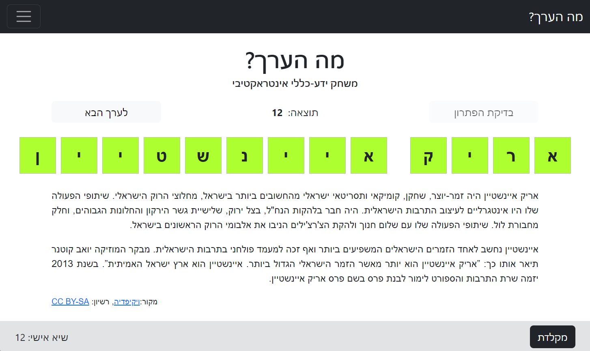

# מה הערך?

This repository contains the source code for an interactive general-knowledge game called 'מה הערך?'. The game is available [here](https://dvd848.github.io/wiki-game/).  
During the game, players are presented with excerpts from various Wikipedia pages.  
These excerpts are 'censored', with several keywords and phrases removed.  
Players must then guess the original title of the page based on the remaining content.

In order to avoid including esoteric or obscure pages in the game, the titles are based on the top-1000 most-viewed pages from the past few days, and the list is updated daily to keep things interesting and up to date.

https://github.com/Dvd848/wiki-game/assets/864431/c6a1b779-c80c-4fcd-867a-48070c2ee69a

## Development

Developed this as a mini-project to get acquainted with React.  
As this is my first attempt, I'm not sure the result is "React-ish" enough. It would be great to hear feedback on the approach that 
experienced React developers whould take when designing a similar
application.

## License

The Wikipedia articles are released under [CC BY-SA](https://creativecommons.org/licenses/by-sa/4.0/).  
The remaining source code is released under [GPLv3](https://www.gnu.org/licenses/gpl-3.0.en.html).
